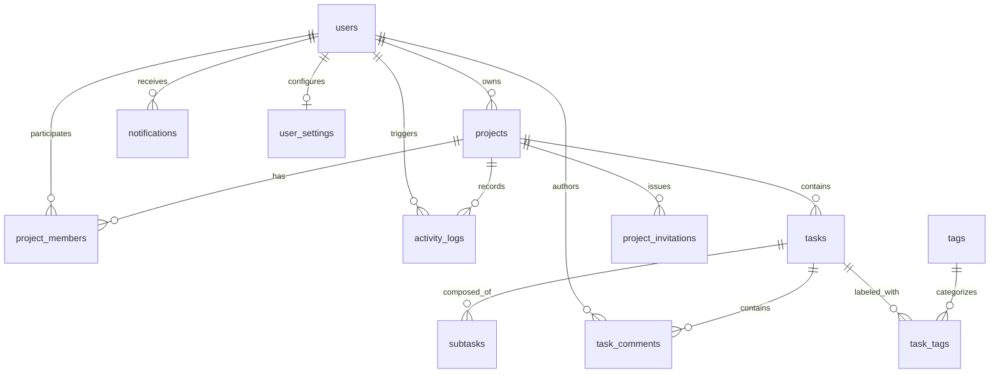

# TaskFlow — Relational Database Schema & Data Dictionary

This document details the entity-relationship model, tables, indexes, constraints, and cascade delete rules used by TaskFlow's SQLite/SQLAlchemy 2.0 persistence layer.

---

## 1. Entity-Relationship Diagram (ERD)

---

## 2. Table Specifications

### 2.1 `users`
Represents registered application accounts.
- `id` (INTEGER, Primary Key, Auto-increment, Indexed)
- `email` (VARCHAR(255), Unique, Indexed, NOT NULL)
- `hashed_password` (VARCHAR(255), NOT NULL)
- `full_name` (VARCHAR(255), Nullable)
- `is_active` (BOOLEAN, Default TRUE, NOT NULL)
- `created_at` (TIMESTAMP WITH TIME ZONE, Server Default `now()`, NOT NULL)

### 2.2 `projects`
Containers for work items, owned by an individual user.
- `id` (INTEGER, Primary Key, Auto-increment, Indexed)
- `name` (VARCHAR(120), Indexed, NOT NULL)
- `description` (TEXT, Nullable)
- `owner_id` (INTEGER, Foreign Key `users.id` ON DELETE CASCADE, Indexed, NOT NULL)
- `created_at` (TIMESTAMP WITH TIME ZONE, Server Default `now()`, NOT NULL)

### 2.3 `project_members`
Collaborator associations granting access tiers to non-owners.
- `id` (INTEGER, Primary Key, Auto-increment, Indexed)
- `project_id` (INTEGER, Foreign Key `projects.id` ON DELETE CASCADE, Indexed, NOT NULL)
- `user_id` (INTEGER, Foreign Key `users.id` ON DELETE CASCADE, Indexed, NOT NULL)
- `role` (ENUM: `admin`, `member`, `viewer`, Default `member`, NOT NULL)
- `joined_at` (TIMESTAMP WITH TIME ZONE, Server Default `now()`, NOT NULL)
- **Constraint:** Unique `(project_id, user_id)`

### 2.4 `project_invitations`
Pending invitation tokens sent to prospective collaborators.
- `id` (INTEGER, Primary Key, Auto-increment, Indexed)
- `project_id` (INTEGER, Foreign Key `projects.id` ON DELETE CASCADE, Indexed, NOT NULL)
- `inviter_id` (INTEGER, Foreign Key `users.id` ON DELETE CASCADE, NOT NULL)
- `email` (VARCHAR(255), Indexed, NOT NULL)
- `role` (ENUM: `admin`, `member`, `viewer`, Default `member`, NOT NULL)
- `status` (ENUM: `pending`, `accepted`, `revoked`, Default `pending`, NOT NULL)
- `token` (VARCHAR(64), Unique, Indexed, NOT NULL)
- `created_at` (TIMESTAMP WITH TIME ZONE, Server Default `now()`, NOT NULL)
- `expires_at` (TIMESTAMP WITH TIME ZONE, NOT NULL)

### 2.5 `tasks`
Core task units tracked within projects.
- `id` (INTEGER, Primary Key, Auto-increment, Indexed)
- `title` (VARCHAR(200), Indexed, NOT NULL)
- `description` (TEXT, Nullable)
- `status` (ENUM: `todo`, `in_progress`, `review`, `done`, Default `todo`, Indexed, NOT NULL)
- `priority` (ENUM: `low`, `medium`, `high`, `urgent`, Default `medium`, NOT NULL)
- `due_date` (DATE, Nullable)
- `completed_at` (TIMESTAMP WITH TIME ZONE, Nullable)
- `project_id` (INTEGER, Foreign Key `projects.id` ON DELETE CASCADE, Indexed, NOT NULL)
- `assignee_id` (INTEGER, Foreign Key `users.id`, Nullable)
- `created_at` (TIMESTAMP WITH TIME ZONE, Server Default `now()`, NOT NULL)
- `updated_at` (TIMESTAMP WITH TIME ZONE, Server Default `now()`, NOT NULL)

### 2.6 `subtasks`
Checklist milestones belonging to a task.
- `id` (INTEGER, Primary Key, Auto-increment, Indexed)
- `task_id` (INTEGER, Foreign Key `tasks.id` ON DELETE CASCADE, Indexed, NOT NULL)
- `title` (VARCHAR(255), NOT NULL)
- `is_completed` (BOOLEAN, Default FALSE, NOT NULL)
- `position` (INTEGER, Default 0, NOT NULL)
- `due_date` (DATE, Nullable)
- `created_at` (TIMESTAMP WITH TIME ZONE, Server Default `now()`, NOT NULL)
- `updated_at` (TIMESTAMP WITH TIME ZONE, Server Default `now()`, NOT NULL)

### 2.7 `task_comments`
Discussion notes and threaded replies attached to tasks.
- `id` (INTEGER, Primary Key, Auto-increment, Indexed)
- `task_id` (INTEGER, Foreign Key `tasks.id` ON DELETE CASCADE, Indexed, NOT NULL)
- `author_id` (INTEGER, Foreign Key `users.id` ON DELETE CASCADE, Indexed, NOT NULL)
- `content` (TEXT, NOT NULL)
- `parent_id` (INTEGER, Foreign Key `task_comments.id` ON DELETE CASCADE, Nullable, Indexed)
- `created_at` (TIMESTAMP WITH TIME ZONE, Server Default `now()`, NOT NULL)
- `updated_at` (TIMESTAMP WITH TIME ZONE, Server Default `now()`, NOT NULL)

### 2.8 `activity_logs`
Chronological audit stream recording actions.
- `id` (INTEGER, Primary Key, Auto-increment, Indexed)
- `project_id` (INTEGER, Foreign Key `projects.id` ON DELETE CASCADE, Indexed, NOT NULL)
- `task_id` (INTEGER, Foreign Key `tasks.id` ON DELETE CASCADE, Nullable, Indexed)
- `user_id` (INTEGER, Foreign Key `users.id` ON DELETE CASCADE, Indexed, NOT NULL)
- `action` (VARCHAR(64), Indexed, NOT NULL)
- `details` (TEXT, Nullable)
- `created_at` (TIMESTAMP WITH TIME ZONE, Server Default `now()`, NOT NULL)

### 2.9 `tags` & `task_tags`
Global taxonomy labels and many-to-many relationship join table.
- `tags`: `id` (PK), `name` (VARCHAR(50), Unique, Indexed)
- `task_tags`: `task_id` (FK `tasks.id` ON DELETE CASCADE), `tag_id` (FK `tags.id` ON DELETE CASCADE), Primary Key `(task_id, tag_id)`

### 2.10 `notifications` & `user_settings`
User alert inbox and individual delivery preferences.
- `notifications`: `id` (PK), `user_id` (FK `users.id` ON DELETE CASCADE), `title`, `message`, `type`, `link`, `is_read`, `created_at`
- `user_settings`: `id` (PK), `user_id` (FK `users.id` ON DELETE CASCADE, Unique), `email_notifications`, `task_assigned_alerts`, `status_change_alerts`, `theme`, `compact_view`, `created_at`, `updated_at`
